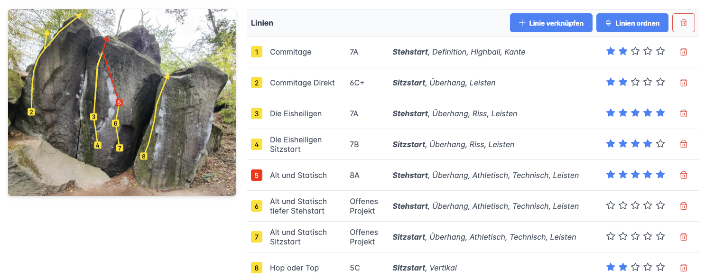
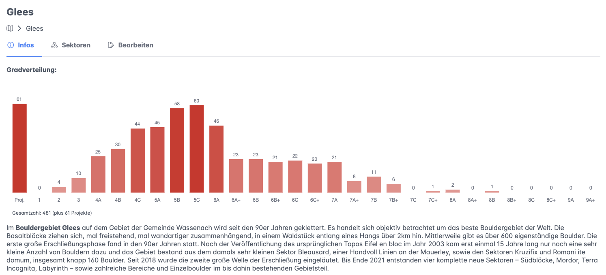
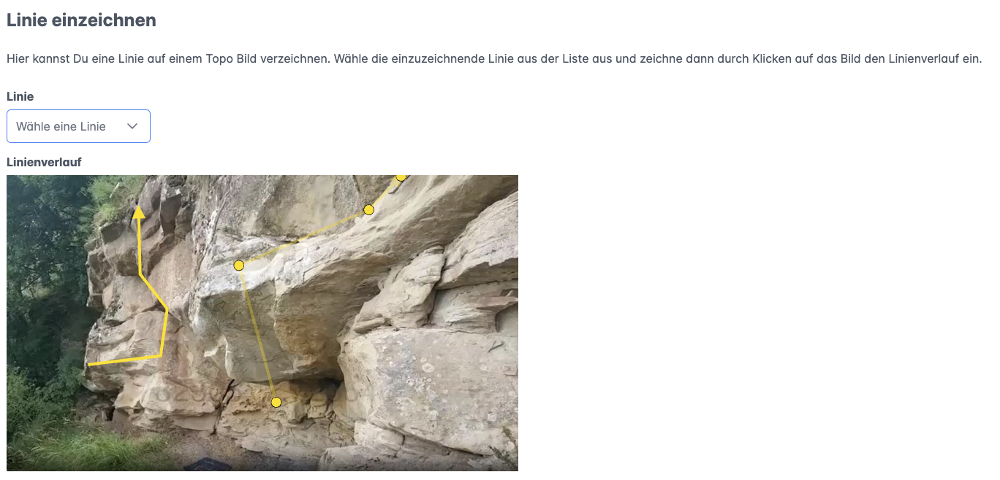

# LocalCrag

Deploy your local alternative to the well known online climbing guide platforms with LocalCrag to keep control over all data in the crags you are developing!

## The idea

As developers of climbing crags you invest hours and hours of work in cleaning lines and managing the politics behind providing public access to the areas you love. A central piece of this work is also to publish information about the areas - usually by providing a paper guidebook or some form of online guide. While developing the Eifel bouldering areas our approach was to use a Wordpress site for publishing information. Like other core developers of areas we know well (e.g. Pfalz) we opted against publishing on well known big platforms as we don't want to give our data out of our hands. Because of brittle access situations we wanted to be in 100% control of all the detailed information that is the fruit of our year long engagement in cleaning all the blocks in the forest. We wanted to be able to act fast if certain events require to restrict information. Corporate interests of big platforms stand in the way of this flexibility. And also, we liked the idea of having our information accessible under our own domain.

This was all perfetly possible by just using Wordpress or some forum software like it is done in other areas. However having all the nice features of a modern topo app is very intriguing. This is why I decided to create LocalCrag. A topo webapp to manage your local climbing area information.

## Core features

- **Self-hosted:** Kepp full control over all the data
- **Online topo:** Publish detailed information about crags, sectors, areas and lines 
- **Line editor:** Draw lines for boulders and routes on images with a simple click-editor
- **Ticklist:** Track your ascends and create todo lists
- **Statistics:** Numerous statistics for lines and ascends
- **News blog:** Publish news for your crags in a blog
- ... more to come! We have a lot of ideas. We are open to your ideas and accept pull requests.

## Runway

1. Currently we a are working on version v1.0.0 which will replace [gleesbouldering.com](https://gleesbouldering.com). This will include all the features you need to create the online topo, a news blog and a few things more.
2. The next step will be to add the ticklist feature for v1.1.0 because we are all data nerds and like statistics.
3. v1.2.0 will focus on making it possible to deploy other instances. We already know a few crag developers who are waiting eagerly (Nahetal, Sudelfeld, ...). 
4. Let's see what the community want's next..

## Current state

Most of v1.0.0 is done and we are currently optimising UI and UX, especially mobile views.

## Screenshots

View lines drawn on images. Hover to highlight them. Click on a line to get more information.

Crag, sector and area information with statistics.

Save time while creating your topo by using a simple click-editor for drawing lines.

## License

All Rights Reserved.

I couldn't find a fitting licence that allows only non-commercial use. However I will grant any climbing and bouldering area developer the right to use LocalCrag and deploy an instance, just contact me. In the meantime I keep looking for a good license..