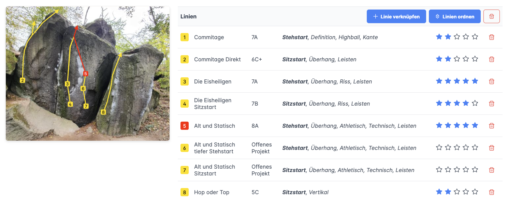
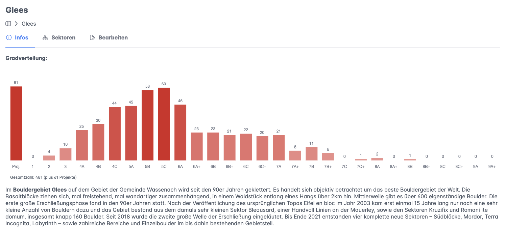
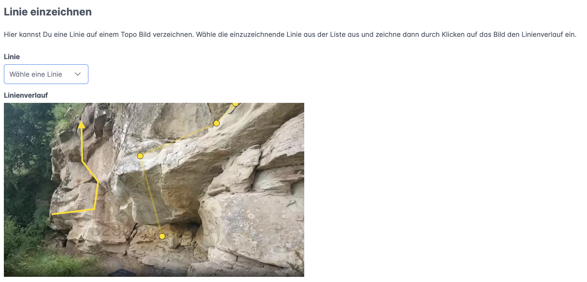

# LocalCrag

Full-featured OSS climbing topo platform that keeps the data in the hand of the locals.

## Background

As developers of climbing crags you invest hours and hours of work in cleaning lines and managing the politics behind providing public access to the areas you love. 
A central piece of this work is also to publish information about the areas - usually by providing a paper guidebook or some form of online guide. 
While developing the Eifel bouldering areas our approach was to use a WordPress site for publishing information. 
Like other developers of areas we know well, we opted against publishing on one of the big platforms. We didn't want to give our data out of our hands and basically gift it to the big platforms to make a profit of.
Because of brittle access situations we wanted to be in 100% control of all the detailed information that is the fruit of our year-long engagement in cleaning all the blocks in the forest. 
We wanted to be able to act fast if certain events require to restrict information. Corporate interests of big platforms stand in the way of this flexibility. 
And also, we liked the idea of having our information accessible under our own domain.

This was all perfectly possible by just using WordPress or some forum software like it is done in other areas. 
However, having all the nice features of a modern topo app is very intriguing. 
This is why I decided to create LocalCrag. A topo webapp to manage your local climbing area information.

## Core features

- **Self-hosted:** Keep full control over all the data
- **Online topo:** Publish detailed information about crags, sectors, areas and lines 
- **Line editor:** Draw lines for boulders and routes on images with a simple click-editor
- **Tick list:** Track your ascends and create todo lists
- **Statistics:** Numerous statistics for lines and ascends
- **News blog:** Publish news for your crags in a blog
- **Multilanguage:** LocalCrag is built using transloco. Adding new languages is easy and there is also the possibility to run your instances in multiple languages.
- ... more to come! We have a lot of ideas. We are open to your ideas and accept pull requests.

## Rock Explorer

Rock Explorer is a map-based tool for documenting places while you scout for new rock — boulders, cliffs, and sectors that are not in the topo yet.

Use it to capture what you found in the field and share it with other developers in your instance:

- **Map features** — mark spots as points or polygons, edit geometry later, and link features to existing topo objects (crags, sectors, areas, lines).
- **Field metadata** — record potential, rock quality, rock type, grade range, climb type, and access issues (NSG, FFH, private land, etc.).
- **Photos** — attach geotagged images, pick locations on the map, and show image pins on the basemap.
- **Approach info** — add parking sites and hand-drawn approach paths.
- **Record mode** — walk in with GPS tracking to capture paths; drafts are stored locally, sync when back online, and can be continued across sessions.
- **Map tools** — switch base maps (topo, satellite, …), toggle custom overlays, adjust opacity, filter features, search by coordinates or place name, and share a feature via link.

### Custom maps

Rock Explorer uses MapLibre and can be configured per instance under **Instance settings → Maps**:

- **Base maps** — any MapLibre style JSON URL (e.g. MapTiler topo/satellite, national basemaps). Set separate defaults for the topo line editor and for Rock Explorer.
- **Overlays** — optional raster or vector layers shown only in Rock Explorer, stacked in list order. Typical uses include hillshade/DEM, geology maps, nature reserves, or other MVT/MBTiles you serve via TileJSON or an `{z}/{x}/{y}` URL. Tile hosts must allow CORS for your instance origin.

### Place search (Photon)

Location search (addresses, towns, peaks, and other named places) uses the free [Photon](https://github.com/komoot/photon) geocoding API (OpenStreetMap data). Coordinate input (`lat, lng`) still works and takes priority. Photon is a shared public service and **may be rate-limited or temporarily unavailable**; if search fails, try again later or jump using raw coordinates.

## Example instances

- [gleesbouldering.com](https://gleesbouldering.com/) - The OG LocalCrag instance showcasing undisputably the best bouldering area in the world - the Eifel in Germany
- [nahetalbouldering.com](https://nahetalbouldering.com/) - The lesser known Nahetal sandstone bouldering area
- [goewalddb.de](https://goewalldb.de/) - Bouldering in the Göttinger Forest - HDWG!
- [mainbloc.de](https://topo.mainbloc.de/) - Taunus bouldering!

## Screenshots

View lines drawn on images. Hover to highlight them. Click on a line to get more information.

Crag, sector and area information with statistics.

Save time while creating your topo by using a simple click-editor for drawing lines.

## Installation

If you want to use LocalCrag for your own crag, either deploy [via docker](./docs/docker-compose-installation.md) or [helm on k8s](./helm/localcrag/README.md) or join our cloud, it's up to you. If you join our cloud you will get automated updates, but you will have to pay a hosting fee (we will not make money charging this fee, it's 1:1 what our cloud provider charges us).

### Configuration

- You can configure your instance by visiting `/instance-settings`
- If you choose to use Matomo tracking, be sure to set up your Matomo instance in a way that anonymizes user data. Currently, there is no opt-in cookie banner provided, so tracking has to follow your local privacy legislation.

## Contributing

LocalCrag is an open-source project, and we welcome contributions from the community.

If you'd like to contribute, please fork the repository and make changes as you'd like. Pull requests are warmly welcome.

See the [dev tooling guide](./docs/dev-tooling.md) for more information on how to set up your development environment.

### Our contributors

## License

This project is licensed under the AGPL-3.0 License - see the [LICENSE](./LICENSE) file for details.
